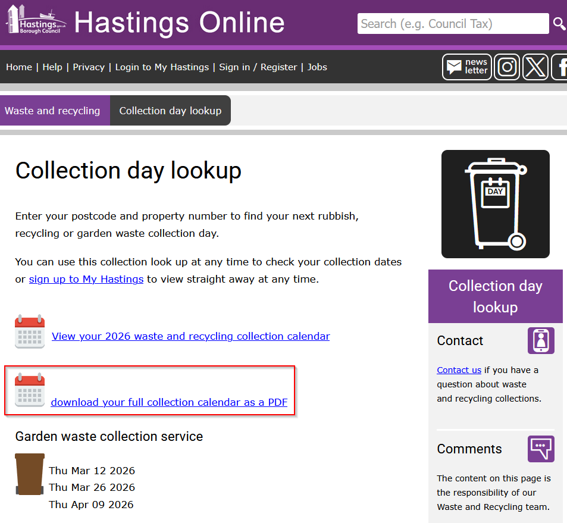
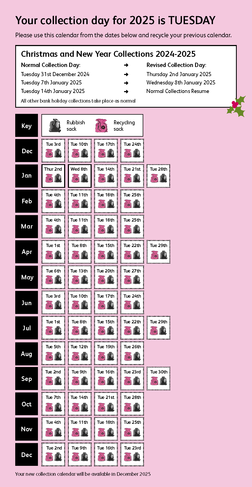
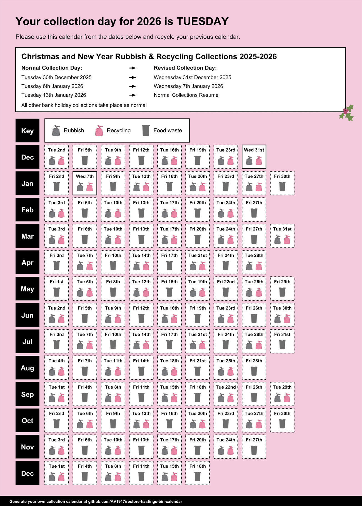
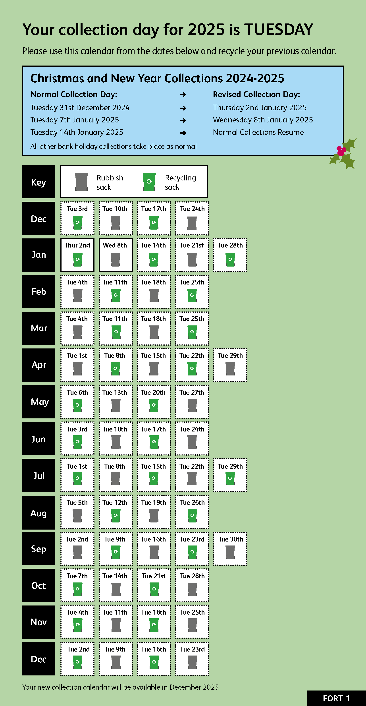
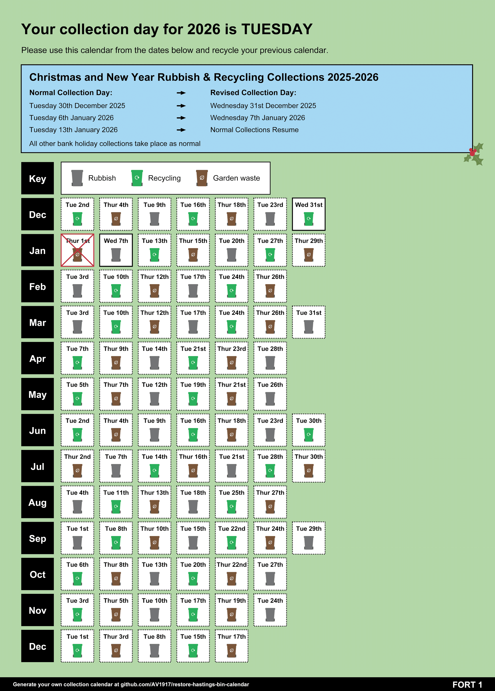

# Restore Hastings Bin Calendar

Hastings Borough Council used to provide a downloadable PDF schedule. Unfortunately, according to comments on their Facebook page, they removed it for 2026 for 'accessibility reasons' and claims that 'it wasn't downloaded often enough.'

This userscript puts the **Download your full collection calendar as a PDF** button back onto the Hastings Borough Council collection lookup page, right where it used to be and exactly how it used to look – and it downloads an automatically-generated PDF schedule bespoke to your collection days and types.

All efforts have been taken to make the PDF look as much like the original PDF provided by the council as possible – but not without some improvements:

- Shows garden waste and food waste too – not just rubbish and recycling
- Includes holiday exceptions and cancellations (where available)
- Built in true A4 to make better use of the available space

## Installation
1. Install [Tampermonkey](https://www.tampermonkey.net/) in your browser
2. Open the raw userscript file: https://github.com/AV1917/restore-hastings-bin-calendar/raw/main/restore-hastings-bin-calendar.user.js
3. Tampermonkey should open an install screen automatically
4. Click **Install**

## How to use it
1. Go to: https://www.hastings.gov.uk/waste_recycling/lookup/
2. Run your normal address lookup
3. Click **Download your full collection calendar as a PDF**

## Comparisons
### Weekly
| [Original](docs/original/RecTueRefTue.pdf) | [New](docs/new/RecTueRefTue-2026.pdf) |
| --- | --- |
|  |  |

### Fortnightly
| [Original](docs/original/RecTueFort1RefTueFort2.pdf) | [New](docs/new/RecTueFort1RefTueFort2-2026.pdf) |
| --- | --- |
|  |  |

## What it does
After you run an address lookup on the Hastings collection lookup page, the script:
- Grabs the collection data already loaded on the page
- Works out your schedule
- Pulls in the matching Hastings calendar page
- Builds a PDF calendar for that address
- Adds rubbish and recycling, plus garden and food waste when the site gives enough data
- Shows Christmas / New Year exceptions at the top

## How it works
Very roughly, the script combines three things:

- The live lookup data from the page
- The full Hastings calendar page for your schedule
- The Hastings Christmas / New Year collections page

If garden waste or food waste dates are incomplete, it can extend the pattern from the real dates it already has. Real website dates always take priority over guessed ones.

Over the Christmas period, if no real data is available, food waste and garden waste are omitted to ensure that calendar dates are as accurate as possible.

## Disclaimer
- This userscript is unofficial and is in no way affiliated with Hastings Borough Council.
